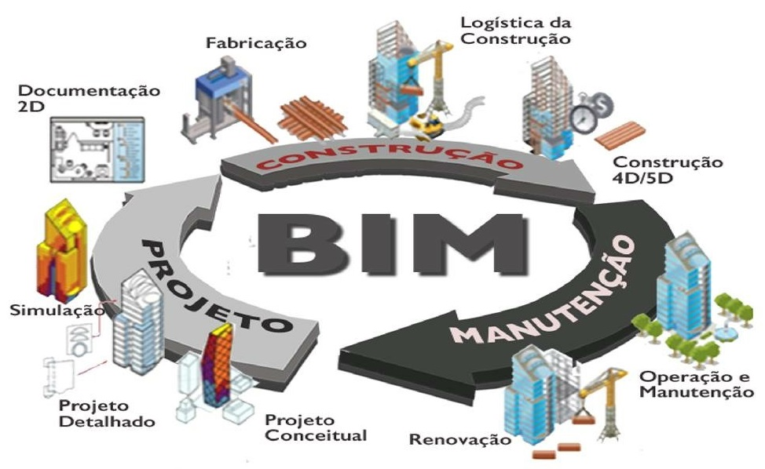

# **O que é BIM?**
<!-- - **Definição:** Modelagem digital integrada com informações multidisciplinares.
- **Histórico:** Evolução do BIM no setor de construção.
- **Diferença entre BIM e CAD:**
  - BIM: Informações integradas em 3D, ciclo de vida do projeto.
  - CAD: Modelagem apenas geométrica, sem integração de dados.-->


Os modelos tradicionais, como **Projeto-Concorrência-Construção** e **Design-Build**, apresentam desafios significativos de **fragmentação**, **falta de integração** e **comunicação ineficiente** entre os diferentes atores do projeto, como proprietários, projetistas, construtores e subempreiteiros. Essa fragmentação gera conflitos, atrasos, retrabalhos e impactos no orçamento e cronograma das obras.
  


O **BIM (Building Information Modeling)** resolve esses problemas ao integrar todas as disciplinas e partes interessadas em um **modelo único e centralizado**. O uso do BIM promove a colaboração em tempo real, permitindo acesso transparente a informações do projeto, como prazos, orçamentos e especificações técnicas. Além disso, facilita a visualização em 3D, melhora a tomada de decisões e aumenta a eficiência na gestão de recursos e execução.  


Em geral, a estrutura interna de uma instância de um objeto, como definida dentro de um sistema de modelagem paramétrica, é um grafo orientado, onde os nós são classes de objetos com parâmetros ou operações que constroem ou modificam uma instância de objeto; links no grafo indicam relações entre os nós. 


No modelo **Design-Build**, o BIM se destaca ao unificar o processo de projeto e construção, garantindo maior previsibilidade, controle e qualidade na entrega final. Assim, o BIM se alinha às boas práticas de **gerenciamento de projetos** propostas pelo PMBOK, como integração, gestão de recursos e controle de qualidade, tornando-se essencial para projetos mais eficientes e bem-sucedidos.  

Com base na imagem fornecida, podemos extrair um resumo que **organiza e descreve as aplicações do BIM ao longo do ciclo de vida da construção**. Vou estruturar isso de forma clara e complementar com informações adicionais.

---

## **Aplicações do BIM no Ciclo de Vida da Construção**



### **1. BIM na Concepção**
Na fase inicial do projeto, o BIM é aplicado para:
- **Programa arquitetônico** e concepção inicial.
- **Estudos de massa** e modelagem volumétrica.
- **Estudos de movimentação de terra** para otimização de cortes e aterros.
- **Estimativa preliminar de custos** (macro-BIM).
- **Visualização do projeto** em 3D, facilitando o entendimento pelo cliente.

---

### **2. BIM no Projeto**
Durante o desenvolvimento do projeto:
- **Modelagem 3D paramétrica** com detalhamento.
- Coordenação interdisciplinar (arquitetura, estrutura, instalações).
- **Detecção de interferências** (clash detection) para evitar problemas na construção.
- Aplicação de **normas de desempenho** e sustentabilidade (LEED, AQUA).
- **Documentação** automatizada e extração de dados.

---

### **3. BIM no Planejamento**
O BIM contribui significativamente no planejamento da obra ao:
- **Extrair quantitativos** diretamente do modelo.
- Realizar o **planejamento 4D** (tempo) integrando cronogramas.
- Simular **recursos** e **custos** (5D).
- Melhorar a **gestão de riscos** e de recursos materiais e humanos.
- Acompanhamento **físico-financeiro** da obra.

---

### **4. BIM na Análise Térmica/Energética**
- Simulações térmicas e energéticas.
- Avaliação do conforto térmico e desempenho energético.
- Testes com diferentes materiais e soluções de projeto visando sustentabilidade.

---

### **5. BIM na Análise Estrutural**
- Análise estrutural detalhada.
- Integração entre modelos de cálculo e projetos estruturais.
- Simulação de cargas e verificações normativas.

---

### **6. BIM na Construção**
Na fase de execução, o BIM permite:
- **Compatibilização** dos projetos (arquitetura, estrutura, instalações).
- Gestão de **quantitativos** e orçamento em tempo real.
- **Planejamento de canteiro de obras** e logística.
- Redução de erros por meio da **visualização 3D**.
- **Pré-fabricação** de elementos e redução de desperdícios.
- **Monitoramento da execução** e controle de qualidade.

---

### **7. BIM no Retrofit**
Aplicação do BIM em construções existentes:
- **Levantamento de condições existentes** usando tecnologia como **scanners a laser**.
- Criação de modelos **as-built** (modelos do que existe).
- Planejamento de **intervenções** para reforma ou retrofit.
- Simulações de novas soluções e desempenho.

---

### **8. BIM na Demolição**
- **Planejamento** da demolição com foco em segurança.
- **Gestão de resíduos**: materiais recicláveis e reaproveitamento.
- Análise de **deslocamentos** e elementos estruturais para otimização do processo.

---

### **9. BIM na Operação e Manutenção (6D)**
Na fase pós-obra, o BIM se torna uma ferramenta poderosa para:
- **Gestão de facilities** usando o modelo como base.
- Importação do modelo BIM para **sistemas CAFM** (Computer-Aided Facility Management).
- Planejamento de **manutenção preventiva** e corretiva.
- Redução de custos operacionais com dados integrados ao longo do ciclo de vida.

---

## **Resumo**
O BIM se estende por todo o **ciclo de vida da edificação**: da concepção e planejamento, passando pela construção e operação até o retrofit e demolição. Ele agrega dimensões como **tempo (4D)**, **custos (5D)** e **sustentabilidade (6D)**, permitindo uma gestão mais eficiente, colaborativa e integrada dos projetos.


## **BIM na Gestão de Projetos e Normas Relacionadas**

## **1. Introdução ao Tema**
<!-- ### **Objetivo da Aula**
- Entender como o BIM é utilizado na gestão de projetos.
- Relacionar o uso do BIM aos **princípios do PMBOK** para a gestão de projetos.
- Conhecer as principais normas que regulamentam o uso do BIM.-->

### **Relação com o PMBOK**
- Princípios do PMBOK como base para a adoção do BIM:
  - **Foco no Valor:** BIM contribui diretamente para geração de valor, reduzindo custos e entregando maior eficiência ao cliente.
  - **Pensamento Sistêmico:** BIM integra diferentes disciplinas e stakeholders em um único sistema digital.
  - **Colaboração e Engajamento dos Stakeholders:** O BIM facilita a colaboração e a comunicação visual entre todas as partes interessadas.

---

## **2. BIM na Gestão de Projetos**
### **Vantagens do BIM**
#### **Alinhadas aos Princípios do PMBOK**
1. **Visualização e Simulações:**
   - Conexão com o princípio de **entrega incremental de valor**, pois o BIM permite antecipar problemas e planejar entregas eficazes.
2. **Colaboração Multidisciplinar:**
   - Relacionado ao princípio de **engajamento ativo dos stakeholders**. O BIM cria um ambiente onde todas as disciplinas colaboram com dados integrados.
3. **Redução de Erros e Retrabalhos:**
   - Apoiado pelo princípio de **gestão de risco adaptativa**. O BIM antecipa e resolve conflitos (clash detection) antes da execução.
4. **Acompanhamento do Ciclo de Vida:**
   - Conexão com **responsabilidade e ciclo de vida do projeto**, promovendo uma visão sistêmica da obra desde o planejamento até a operação.

---

## **As 10 Dimensões do BIM**


  
As **10 dimensões do BIM** representam a evolução do uso de modelos digitais, indo muito além da simples representação em 3D. Elas permitem integrar **tempo, custos, sustentabilidade, segurança e operação** ao modelo, agregando mais valor e eficiência em todas as etapas do ciclo de vida do projeto.
### **1D – Planejamento Conceitual**  
O primeiro estágio, antes da criação de modelos digitais, envolve a **definição conceitual** do projeto. Nessa etapa, são discutidos objetivos, premissas e os principais elementos que guiarão o desenvolvimento do projeto.

---

### **2D – Documentação e Desenhos**  
Corresponde às representações bidimensionais (plantas, cortes e elevações). Embora ainda seja a base em muitos projetos, o BIM evolui para integrar mais dimensões.

---

### **3D – Modelagem Tridimensional**  
É a criação do **modelo 3D inteligente**, com geometrias e propriedades dos elementos construtivos (paredes, pilares, lajes, etc.). Essa representação visual melhora o entendimento do projeto, a comunicação e a detecção de interferências.

---

### **4D – Planejamento e Tempo**  
Adiciona a **dimensão do tempo** ao modelo 3D. A partir do BIM 4D, é possível realizar simulações do **cronograma** da obra, visualizar o progresso da construção e identificar atrasos ou conflitos no planejamento.

---

### **5D – Custos**  
O **BIM 5D** integra dados financeiros ao modelo, permitindo **estimativas de custos** detalhadas e atualizadas em tempo real. Isso facilita o controle orçamentário e o acompanhamento de gastos ao longo do projeto.

---

### **6D – Sustentabilidade**  
A dimensão da **sustentabilidade** foca em análises de eficiência energética, consumo de recursos e impacto ambiental. O BIM 6D permite realizar simulações térmicas, de iluminação e de eficiência de materiais.

---

### **7D – Operação e Manutenção**  
O **BIM 7D** estende o uso do modelo para a fase de operação do edifício, facilitando a **gestão de facilities**. O modelo inclui dados sobre os componentes (vida útil, manutenções necessárias, garantias), apoiando a operação ao longo do ciclo de vida da edificação.

---

### **8D – Segurança no Trabalho**  
Essa dimensão incorpora práticas de **segurança ocupacional** durante o planejamento e execução da obra. O BIM 8D ajuda a identificar riscos, otimizar o layout do canteiro de obras e criar medidas de prevenção de acidentes.

---

### **9D – Lean Construction**  
O **BIM 9D** aplica os conceitos de **Lean Construction** para melhorar a produtividade e reduzir desperdícios. Ele ajuda a planejar fluxos de trabalho, otimizar processos e sincronizar as atividades de construção.

---

### **10D – Industrialização da Construção**  
O **BIM 10D** integra o processo de **industrialização e pré-fabricação**. Com ele, é possível planejar componentes modulares, otimizando a produção fora do canteiro de obras, acelerando prazos e reduzindo custos.

---


### **Desafios no Uso do BIM**
- **Relatórios Adaptáveis:** Relacionados ao princípio de **adaptação ao contexto**. Equipes precisam ajustar-se a tecnologias e processos específicos.

---

## **3. Normas Relacionadas ao BIM**


### **Normas ISO**
- **ISO 19650 (Gestão de Informações):**
  - **Parte 1:** Conceitos e princípios.
  - **Parte 2:** Processo de entrega de informações ao longo do ciclo de vida do projeto.
  - Conexão com o princípio de **pensamento sistêmico**, integrando informações em um único modelo.
- **ISO 12006-2:** Estruturação de classificação para construção.
- **ISO 29481:** Fluxo de informações em projetos colaborativos, em linha com o princípio de **engajamento ativo dos stakeholders**.

### **Normas Brasileiras (ABNT)**
- **NBR 15575:** Requisitos de desempenho em projetos, alinhados ao princípio de **foco na qualidade**.
- **NBR 15965:** Estruturação e classificação de objetos no ambiente BIM.

### **Políticas Públicas**
- **Decreto n.º 10.306/2020:**
  - Estratégia BIM BR, que promove o uso do BIM em obras públicas no Brasil.
  - Relacionado ao princípio de **alinhamento estratégico** com os objetivos nacionais.

---

O **marco legal do BIM** no Brasil está em desenvolvimento contínuo, especialmente devido ao seu impacto na eficiência dos processos da construção civil e da infraestrutura. A regulamentação busca padronizar o uso do BIM, promover a adoção em projetos públicos e privados, e facilitar a implementação em larga escala. Abaixo estão os principais pontos sobre o **marco legal do BIM**:

---

## **1. Estratégia Nacional de Disseminação do BIM (Estratégia BIM BR)**
A Estratégia BIM BR foi estabelecida pelo **Decreto nº 9.983**, de 22 de agosto de 2019, e serve como o principal marco legal para a implementação do BIM no Brasil.

### **Objetivos principais da Estratégia BIM BR**:
- **Promover a adoção do BIM** no setor público e privado.
- Incentivar o **desenvolvimento e aplicação de normas técnicas**.
- Ampliar a capacitação e qualificação de profissionais e empresas.
- Estimular o **uso de ferramentas tecnológicas** e a interoperabilidade.
- Fomentar a inovação e a digitalização da construção civil.

---

## **2. Fases da Implementação do BIM no Brasil**
O Decreto nº 9.983 estabelece a obrigatoriedade gradual do BIM em obras públicas federais. A implementação está dividida em **três fases principais**:

### **Fase 1 (a partir de 2021)**  
- Aplicação do BIM em **projetos de arquitetura e engenharia** para a elaboração de modelos que contenham informações geométricas e dados sobre os elementos construtivos.  

### **Fase 2 (a partir de 2024)**  
- Expansão para a execução de obras públicas, incluindo a **gestão de informações** do modelo durante a construção e o acompanhamento físico-financeiro.

### **Fase 3 (a partir de 2028)**  
- Aplicação do BIM em **todo o ciclo de vida da construção**, incluindo operação e manutenção das edificações e infraestrutura.

---


## **3. Normas Técnicas Relacionadas ao BIM**
A regulamentação do uso do BIM é complementada por normas técnicas nacionais e internacionais. No Brasil, a **ABNT** (Associação Brasileira de Normas Técnicas) publicou normas específicas que garantem a padronização e a interoperabilidade.

### **Principais normas ABNT relacionadas**:
- **ABNT NBR ISO 19650**: Gestão da informação ao longo do ciclo de vida da edificação e infraestrutura usando BIM.
- **ABNT NBR 15965**: Classificação da informação na construção civil.
- **ABNT NBR 13532**: Elaboração de projetos de edificações – Processo de projeto.

Essas normas seguem padrões internacionais como os definidos pela **ISO** e pela organização **buildingSMART**, responsável pela estruturação dos **modelos IFC (Industry Foundation Classes)**.

---

## **4. Uso do BIM em Licitações Públicas**
O **marco legal do BIM** introduz a necessidade do seu uso em **contratações públicas**. O BIM é obrigatório em contratos que envolvem:
- **Modelagem e elaboração de projetos**.
- Gestão e acompanhamento da obra.
- Operação e manutenção de edifícios e infraestrutura pública.

A utilização do BIM nas licitações públicas visa:
- Melhorar a **transparência e eficiência** dos processos.
- Reduzir erros e retrabalhos durante a execução.
- Facilitar o **gerenciamento de custos** e prazos.

---

## **5. Incentivos e Políticas Governamentais**
O Governo Federal promove incentivos ao uso do BIM por meio de:
- **Linhas de crédito** específicas para empresas que adotam BIM.
- **Capacitação e treinamento** de profissionais por meio de programas educacionais e parcerias.
- Investimento em **inovação tecnológica** para pequenas e médias empresas.

---

## **6. Desafios na Implementação do Marco Legal**
Apesar dos avanços no marco regulatório, ainda existem desafios como:
- A **falta de capacitação** adequada de profissionais.
- A necessidade de **infraestrutura tecnológica** para pequenas empresas.
- A resistência à mudança por parte de setores tradicionais da construção civil.

---

## **Conclusão**
O marco legal do BIM no Brasil, liderado pela **Estratégia BIM BR** e pelo **Decreto nº 9.983**, tem como foco modernizar e digitalizar o setor da construção civil. A regulamentação, junto com as **normas ABNT** e padrões internacionais, visa promover uma gestão mais eficiente, transparente e integrada dos projetos ao longo de todo o ciclo de vida das edificações e infraestruturas.  

O BIM, ao ser implementado em fases, facilita a adaptação gradual do setor público e privado, garantindo inovação, economia de recursos e melhores resultados.

---
A diferença entre o **Marco Legal do BIM** no Brasil (consolidado principalmente pelo Decreto nº 9.983/2019) e o **Decreto nº 10.306/2020** está nos **objetivos**, **âmbito de aplicação** e na **regulamentação prática** da adoção do BIM no setor público.

---

## **1. Decreto nº 9.983/2019 - Estratégia Nacional de Disseminação do BIM (Estratégia BIM BR)**

### **Objetivo**:  
- **Estabelece a estratégia nacional** para a implementação do BIM no Brasil, com diretrizes para estimular o uso da tecnologia no setor público e privado.  
- Foca na **disseminação** e no **planejamento gradual** da adoção do BIM em todo o ciclo de vida das construções.  

### **Principais características**:
- Define **objetivos estratégicos** de implementação do BIM.  
- Estrutura **fases de adoção** em projetos e obras públicas federais.  
- Orienta a necessidade de **capacitação profissional** e adoção de **normas técnicas**.  
- Tem um caráter mais **amplo e programático**, atuando como um **plano de ação** nacional.

---

## **2. Decreto nº 10.306/2020 - Uso do BIM na Execução Direta ou Indireta de Obras Públicas**  

### **Objetivo**:  
- **Regulamenta a aplicação prática do BIM** nas licitações e contratações de obras e serviços de engenharia no âmbito da **Administração Pública Federal direta e indireta**.  
- Visa tornar obrigatório o uso do BIM em determinadas situações, **operacionalizando** a estratégia definida pelo Decreto nº 9.983/2019.

### **Principais características**:
- **Âmbito de aplicação**: Licitações e contratações públicas federais.  
- Torna **obrigatório o uso do BIM** em fases específicas de projetos e obras públicas, sendo implementado em etapas.  
- Determina os **requisitos e processos** para utilização do BIM, como:  
   - Modelagem e execução de projetos;  
   - Gestão e manutenção de informações;  
   - Planejamento e orçamento de obras públicas.  
- Especifica quais etapas do ciclo de vida da obra devem ser modeladas no BIM.  

---

## **Principais Diferenças**

| Aspecto                        | **Decreto nº 9.983/2019**                         | **Decreto nº 10.306/2020**                         |
|--------------------------------|--------------------------------------------------|--------------------------------------------------|
| **Objetivo**                   | Estratégia nacional de disseminação do BIM.      | Regulamenta o uso obrigatório do BIM em obras públicas. |
| **Foco**                       | Planejamento e incentivo à adoção do BIM.        | Aplicação prática do BIM em licitações e obras públicas. |
| **Âmbito**                     | Nacional, com foco em setor público e privado.   | Administração Pública Federal direta e indireta. |
| **Obrigatoriedade**            | Não obriga diretamente o uso do BIM.             | Torna o uso do BIM obrigatório em fases específicas. |
| **Aplicação gradual**          | Define fases de implementação.                   | Estabelece prazos e requisitos para obras públicas. |
| **Normatização**               | Promove adoção de normas técnicas e capacitação. | Define processos e modelos para utilização do BIM. |

---

## **Resumo**  
- O **Decreto nº 9.983/2019** atua como **estratégia nacional**, definindo diretrizes para a adoção do BIM e promovendo sua implementação de forma ampla.  
- O **Decreto nº 10.306/2020** é mais específico, focando em **licitações públicas** e exigindo a **adoção obrigatória** do BIM em obras financiadas pelo Governo Federal.

Portanto, o Decreto nº 10.306/2020 **operacionaliza e complementa** o Marco Legal do BIM definido pelo Decreto nº 9.983/2019.

---

## **Normatização e Modelos IFC no BIM**

### **Normatização no BIM**  
A implementação do **BIM** em projetos de construção exige a adoção de **normas técnicas** que padronizem processos, dados e modelos. A normatização garante **interoperabilidade**, **consistência** e **qualidade** nos fluxos de trabalho entre diferentes softwares e profissionais.  

**Principais normas relacionadas ao BIM:**
1. **ISO 19650**: Define os princípios e requisitos para **gestão da informação** ao longo do ciclo de vida da construção com o uso do BIM.
2. **NBR 15965**: Norma brasileira que estrutura o sistema de **classificação da informação** na construção civil.
3. **IFC (Industry Foundation Classes)**: Padrão aberto que permite a interoperabilidade entre diferentes softwares BIM.
4. **COBie (Construction Operations Building Information Exchange)**: Foca na entrega de dados para operação e manutenção de edificações.

A normatização facilita a colaboração entre as partes interessadas, desde o projeto até a operação da construção, garantindo que os dados possam ser utilizados de forma eficiente e sem perda de informações.

---


### **Modelos IFC (Industry Foundation Classes)** 

O **IFC** é um **padrão aberto e neutro** desenvolvido pela **buildingSMART** para promover a **interoperabilidade** entre softwares BIM. Diferente de formatos proprietários (como .rvt ou .dwg), o IFC permite que modelos criados em uma plataforma sejam abertos e editados em outra, garantindo compatibilidade.

O **modelo IFC** atua como um formato aberto para **troca de informações**, promovendo a colaboração entre equipes multidisciplinares e garantindo que os dados permaneçam consistentes ao longo do ciclo de vida do projeto. 


### **Características do IFC:**
- É um **formato de dados estruturado** que descreve informações de elementos construtivos, como paredes, portas, lajes e sistemas (arquitetura, estrutura e instalações).  
- Permite representar **geometria** e **metadados** (propriedades e atributos dos elementos, como materiais e funções).  
- É utilizado em todas as fases do ciclo de vida do projeto: projeto, construção, operação e manutenção.

---

### **Vantagens do Uso de Modelos IFC**
1. **Interoperabilidade**: Facilita a troca de informações entre diferentes softwares (Revit, ArchiCAD, Tekla, entre outros).  
2. **Independência de Software**: É um padrão aberto, não atrelado a um fornecedor específico.  
3. **Gerenciamento de Dados**: Permite uma **estrutura unificada** de dados, essencial para colaboração.  
4. **Ciclo de Vida Completo**: Os modelos IFC podem ser utilizados da concepção até a operação do edifício, com foco em **gestão de facilities**.  

---

### **Aplicação Prática**  
Por exemplo, ao trabalhar em um projeto de infraestrutura, como uma **ponte**, os profissionais podem criar o modelo em um software específico e exportá-lo em formato **IFC**. Esse modelo pode ser analisado por engenheiros estruturais, verificando interferências ou realizando simulações, sem precisar do mesmo software de origem.


---

## **BIM x Modelo BIM**

### **1. BIM (Building Information Modeling)**  
O **BIM** é um **processo** ou metodologia colaborativa que envolve a criação, o uso e a gestão de informações digitais ao longo de todo o ciclo de vida de um projeto de construção (planejamento, projeto, execução, operação e manutenção). Ele não se restringe a uma ferramenta ou software, mas sim a uma **abordagem integrada** que conecta equipes, dados e processos.  

O principal objetivo do BIM é melhorar a eficiência, reduzir erros, otimizar recursos e facilitar a **comunicação entre os diferentes atores** (projetistas, construtores, gestores e proprietários).

**Características do BIM:**
- Colaboração entre disciplinas em um ambiente compartilhado.  
- Integração de dados para visualização, análise e simulação.  
- Aplicação em todas as fases do ciclo de vida do projeto.  

---

### ** Modelo BIM**  
O **Modelo BIM** é o **produto gerado** a partir do processo BIM. Trata-se de uma representação digital tridimensional (3D) inteligente da construção, que armazena informações detalhadas sobre os elementos do projeto, como materiais, dimensões, custos, prazos e desempenho.  

Diferente de um modelo 3D tradicional, o **modelo BIM** é um banco de dados visual e paramétrico que permite associar informações a cada componente do projeto, facilitando análises avançadas, como:

- **Quantificação de materiais**  
- **Simulação de cronogramas** (4D)  
- **Estimativas de custos** (5D)  
- **Análises energéticas e estruturais**  

**Resumo:** Enquanto o **BIM** é o **processo colaborativo**, o **Modelo BIM** é o **resultado digital** desse processo, sendo utilizado como base para análises, execução e operação do empreendimento.

---  

Essa distinção é fundamental para entender como o BIM revoluciona a **gestão de projetos**, pois combina processos integrados com modelos digitais precisos, gerando eficiência e melhores resultados. 

<!-- ## **4. Atividade Prática **
### **Dinâmica Rápida**
 - Apresente um modelo BIM simples (planta ou maquete 3D).
- Solicite que os alunos identifiquem:
  - Informações integradas (materiais, custos, cronograma).
  - Relacionem essas informações aos princípios do PMBOK:
    - **Exemplo:** Como a integração facilita a entrega de valor e otimiza recursos?
- **Debate:** Como o BIM transforma a gestão de projetos e gera valor para as partes interessadas? -->

---

## **5. Conclusão e Perguntas**
### **Resumo**
- **Como o BIM alinha-se ao PMBOK?**
  - Facilita o foco no valor, engajamento de stakeholders e gestão de riscos.
  - Garante eficiência e qualidade no ciclo de vida do projeto.
- **Normas como pilares do BIM:**
  - Garantem padronização e promovem a integração no setor.

### **Encaminhamentos**
- **Estudos Adicionais:**
  - Guias da ISO sobre BIM.
  - Estratégia BIM BR: https://www.gov.br/projetobim.
  - PMBOK 7ª edição: Enfoque nos princípios aplicáveis ao BIM.


```