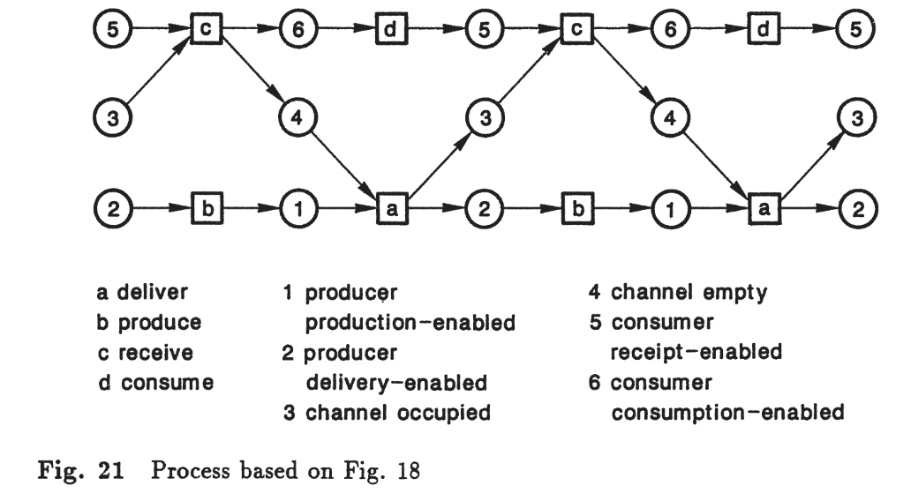
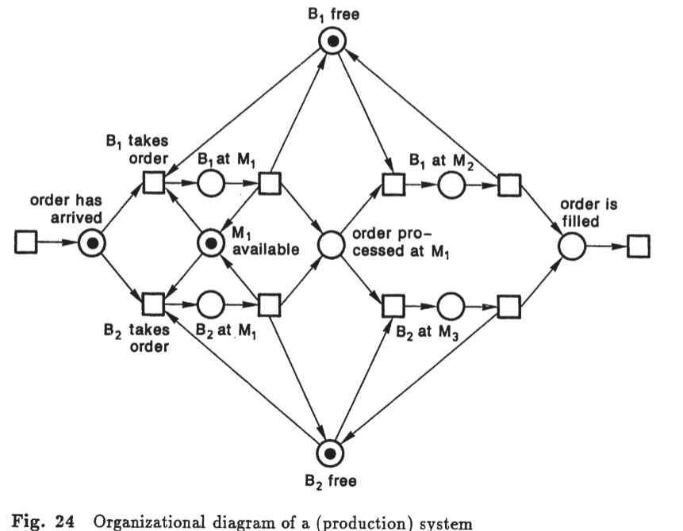
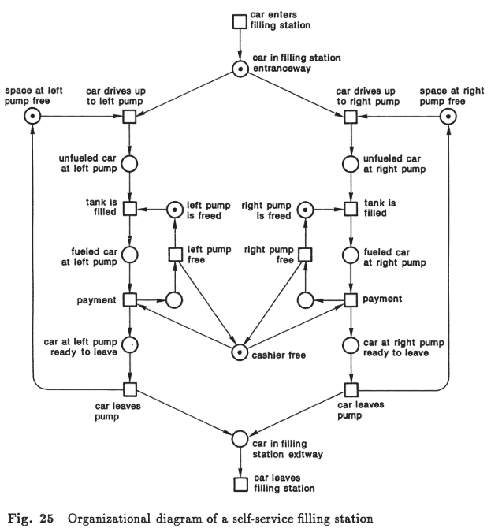

# Capítulo 2 – Redes Condição-Evento (Condition/Event Nets)

## Da Agência-Canal às Redes de Petri
Na formulação original de Carl Adam Petri (1962), as redes foram concebidas para descrever **sistemas de comunicação**. Ele utilizava a ideia de **channel/agency nets**, onde:  

- **Agencies** eram elementos ativos, que executavam transformações.  
- **Channels** eram meios de transporte ou armazenamento de objetos.  

Com o amadurecimento da teoria, essa visão foi refinada para **condition/event nets**, que enfatizam a estrutura lógica:  

- **Conditions** → estados possíveis do sistema (verdadeiros ou falsos).  
- **Events** → transformações que alteram quais condições são verdadeiras.  

Mais tarde, a mesma estrutura foi representada como **place/transition nets** (a notação mais comum hoje):  

- **Places** correspondem às condições.  
- **Transitions** correspondem aos eventos.  

Assim, *condition/event nets* podem ser vistas como a **primeira formulação estruturada das redes de Petri**, imediatamente anterior ao formalismo *place/transition*. Neste capítulo, seguimos a terminologia de Reisig, que parte das **redes condição-evento** para introduzir gradualmente o formalismo mais geral.

---

## 2.1 Um Exemplo
Considere um sistema genérico onde objetos são:  
1. **Produzidos**,  
2. **Armazenados em um canal**,  
3. **Removidos em algum instante**,  
4. **Consumidos** posteriormente.  

Esses objetos podem ser **bens, mensagens, dinheiro, dados ou serviços**. O interesse está no **padrão comum de comportamento**, e não em um domínio específico.  

- O evento **deliver** pode ocorrer quando:  

$$
\text{prod\_ready\_deliver} = 1 
\quad \land \quad 
\text{channel\_occupied} = 0 
\quad \land \quad 
\text{prod\_ready\_producer} = 0
$$

- Após sua ocorrência, temos:  

$$
\text{prod\_ready\_deliver} \gets 0
$$

$$
\text{channel\_occupied} \gets 1
$$

$$
\text{prod\_ready\_producer} \gets 1
$$

---

## 2.2 Regras Formais
Uma rede condição-evento é composta por:  
- **Condições** ($b \in B$), representadas por círculos;  
- **Eventos** ($e \in E$), representados por retângulos;  
- **Arcos** de condições para eventos ($b \to e$) e de eventos para condições ($e \to b$);  
- **Tokens** (@), representando quais condições estão satisfeitas.  

### Definições:
- $b \to e$ significa que $b$ é **pré-condição** de $e$.  
- $e \to b$ significa que $b$ é **pós-condição** de $e$.  
- Um **caso** é o conjunto $C \subseteq B$ de condições satisfeitas.  

Um evento $e$ está **ativado** em $C$ se:  

$$
\forall b \in \text{pre}(e): b \in C 
\quad \land \quad 
\forall b \in \text{post}(e): b \notin C
$$

Quando $e$ ocorre, o novo caso é:  

$$
C' = (C \setminus \text{pre}(e)) \cup \text{post}(e)
$$

 

---

## 2.3 Conflitos
Dois eventos $e_1, e_2$ estão em **conflito** se ambos são ativados, mas a ocorrência de um desativa o outro.  

Formalmente:  

$$
e_1, e_2 \in E \text{ estão em conflito em } C 
\iff 
(e_1 \text{ ativado em } C \land e_2 \text{ ativado em } C)
\land 
\big( C'_{e_1} \not\models e_2 \;\; \lor \;\; C'_{e_2} \not\models e_1 \big)
$$

Exemplo: dois processos competindo por uma chave para acessar memória.  

![**\[Dois processos competindo pelo recurso\]**](img/Fig15CompRec.png)

---

## 2.4 Contatos e Complementação
Um **contato** ocorre quando:  
- todas as pré-condições de um evento estão satisfeitas,  
- **e pelo menos uma de suas pós-condições também está satisfeita**.  

Formalmente:  

$$
\text{Contato}(e, C) \iff 
\big( \text{pre}(e) \subseteq C \big) 
\land 
\big( \text{post}(e) \cap C \neq \emptyset \big)
$$

Para eliminar contatos, introduz-se a **condição complementar**:  
- Para cada condição $b$, define-se $b'$ tal que:  
  - $b$ pré-condição de $e \iff b'$ é pós-condição de $e$.  
  - Em qualquer caso, exatamente um de $\{b, b'\}$ está satisfeito.  

![**\[Exemplo de canal com complemento "empty"\]**](img/Fig18Complemento.png)

---

## 2.5 Processos em Redes Condição-Evento

Em redes condição-evento, como discutido na Seção 2.2, sempre há a indicação de um **caso inicial**.  
A partir dele (ou de outro caso), **eventos podem ocorrer** e, como consequência, os casos podem ser modificados.  

Um **complexo de eventos desse tipo é chamado de processo**.  
É importante observar que aqui *processo* significa **coleção de ocorrências de eventos** em sistemas ou redes, e **não** o mesmo conceito de *processo* do sistema operacional (como discutido na Seção 2.3).  

### Ocorrências repetidas
Em um processo, eventos podem **se repetir**.  Condições podem **mudar repetidamente** ao longo da evolução.  

### Sequência ou independência?
Seria tentador definir um processo apenas como uma **sequência de eventos**.  
No entanto, essa definição é inadequada:  

- Em certos casos, dois eventos são **independentes**.  
- Exemplo: na **Figura 13**, os eventos *produce* e *receive* podem ocorrer independentemente.  
  - A representação *“primeiro produção, depois recebimento”* é **tão correta (e errada)** quanto *“primeiro recebimento, depois produção”*.  
  - A rede não impõe ordem.  

  

Portanto, **um processo não deve impor sequências arbitrárias** quando eventos podem ocorrer **em paralelo**.  

---

   - Se a ordem entre eventos for **importante para o sistema**, medidas podem ser adotadas para forçar uma sequência.  
   - Exemplo: na **Figura 20**, condições complementares $b_0, b_1$ e um evento $e$ forçam que, após a ocorrência do primeiro evento (*produção* ou *recebimento*), o evento $e$ deve ocorrer antes que o outro aconteça.  
   - Assim, onde a ordem for necessária, ela pode (e deve) ser imposta.  
   - Mas, onde isso não é o caso, deve-se **manter explícita a independência** (paralelismo, concorrência, não-sequencialidade).  

   

---

### Representação de processos
Para representar processos de modo adequado:  

- Cada **ocorrência de evento** é representada como um **retângulo** (box).  
- Cada **realização de condição** é representada como um **círculo**.  
- **Inscrições** identificam os eventos e condições correspondentes.  
- **Setas (arcos)** indicam a **relação causal** entre condições satisfeitas e eventos ocorridos.  

Essa forma de representação é ilustrada na **Figura 21**, baseada na **Figura 18**.  

> Observação: Apenas redes **livres de contato** podem ser representadas diretamente dessa forma.  

---

### Contact-Free Nets
Apesar dessa restrição, isso não é uma limitação real.  
- Vimos na Seção 2.4 que qualquer rede condição-evento pode ser transformada em **rede livre de contato** por meio da **introdução de condições complementares**.  
- Assim, qualquer rede pode ser representada como processo.  

---

### Construção de processos
A **Figura 21** mostra um exemplo da construção de processos.  
A representação em forma de grafo causal explicita a independência e a ordem imposta apenas quando necessário.  

Essa abordagem constitui a base para compreender a **concorrência em redes de Petri**, pois os processos capturam:  
- **Sequências obrigatórias**, quando a estrutura da rede impõe ordem;  
- **Independência**, quando eventos podem ocorrer em paralelo.  

---

---

## 2.6 Exemplos

1. **Sistema de Produção com Máquinas e Operadores** – representação de fluxos alternativos.  

 
   
2. **Posto de Gasolina Self-Service** – modelagem de filas, uso de bombas e pagamento.  
   

## Referências

{cite:p}`prata2004modelo`
{cite:p}`reisig2012primer`

---
