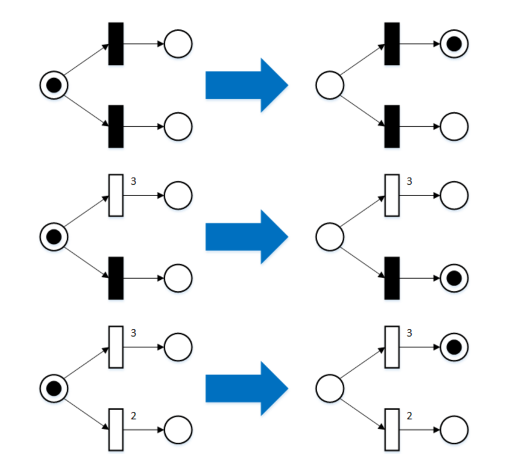
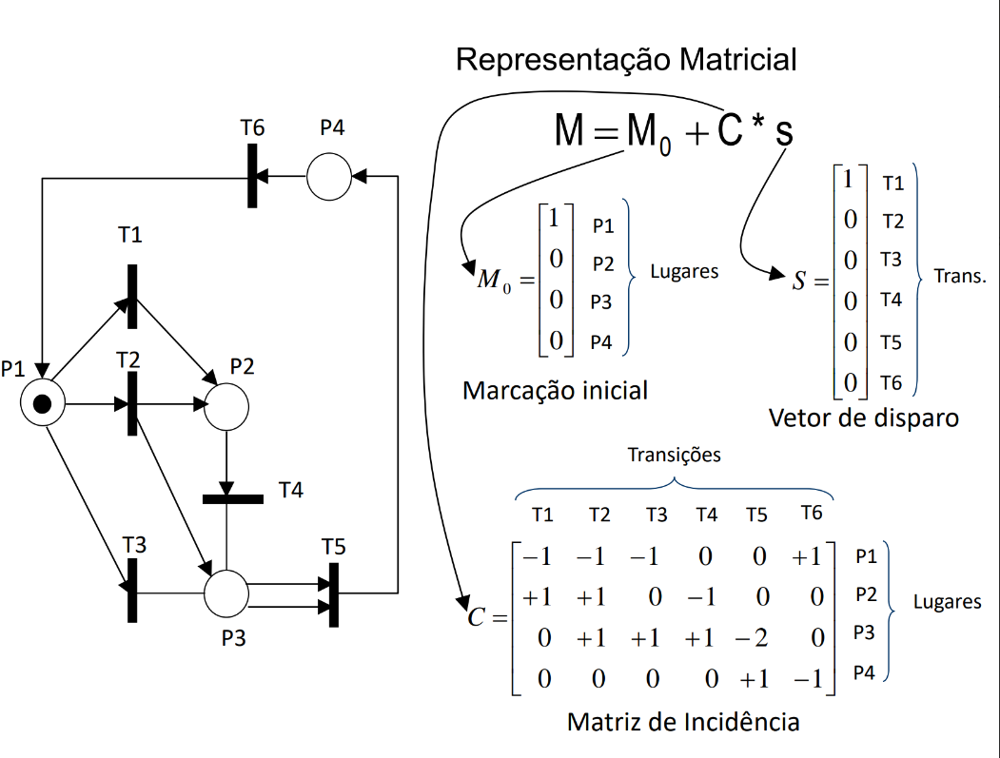

# Redes de Petri – Conceitos Fundamentais

O desenvolvimento de software nas décadas de 1960 e 1970 enfrentava desafios relacionados à **complexidade crescente dos sistemas** e à dificuldade de comunicação entre equipes. Nesse período, os ambientes de desenvolvimento eram colaborativos, utilizando **quadros-negros (blackboards)** como suporte central para a especificação de sistemas. Nos blackboards eram desenhados **fluxogramas**, **diagramas de estados**, **redes de transição** e outros esboços visuais, permitindo que os técnicos expressassem suas ideias de forma clara e imediata. Esse ambiente favorecia reuniões produtivas, com discussões colaborativas, e facilitava a compreensão e o compartilhamento das especificações.

Com a transição para a **programação online**, os quadros foram substituídos por **terminais**, que não suportavam desenhos ou comunicação visual rica, resultando em perda de clareza e interação coletiva. Nesse contexto, a emergência da **programação estruturada** e do **refinamento passo a passo (stepwise refinement)** trouxe maior rigor ao desenvolvimento de software, estabelecendo métodos formais e disciplina para enfrentar a crescente complexidade dos sistemas.

Foi nesse ambiente que surgiram as **Redes de Petri**, formalismo desenvolvido por **Carl Adam Petri** em 1962, capaz de combinar a expressividade visual dos blackboards com uma **base matemática rigorosa**. As Redes de Petri permitem representar **estados, eventos, concorrência e sincronização** de forma gráfica, oferecendo suporte para **modelagem, edição, verificação e revisão de sistemas complexos**. A notação formal combina clareza visual com precisão matemática, permitindo a análise de propriedades críticas, como **alcance (reachability), vivacidade (liveness), deadlock e invariantes de lugar**.

Nos anos 1980, **Jacques Vautherin** introduziu uma abordagem algébrica para Redes de Petri, substituindo tokens tradicionais por **tipos de dados algébricos definidos pelo usuário**, conferindo maior semântica e estrutura aos modelos. Wolfgang **Reisig** aprimorou esse formalismo, integrando-o com **especificações algébricas formais** para representar simultaneamente o **controle**, através da estrutura da rede, e os **dados**, por meio de tipos, assinaturas e axiomas. Essa combinação permitiu modelar sistemas de maneira modular e formal, preservando expressividade visual e precisão matemática.

A história das Redes de Petri está intimamente ligada à **crise do software**, termo cunhado no final dos anos 1960 para descrever problemas emergentes no desenvolvimento de sistemas, como atrasos, custos excessivos e baixa qualidade. Durante a **Conferência da OTAN sobre Engenharia de Software**, realizada em Garmisch, Alemanha, em 1968, o termo foi utilizado oficialmente, destacando a frustração coletiva com os métodos da época. **Edsger W. Dijkstra**, em 1972, enfatizou que controlar a complexidade crescente dos sistemas era um dos problemas mais desafiadores da engenharia. Entre os sintomas da crise estavam o **estouro de prazos e orçamentos**, a entrega de **software de baixa qualidade** e sistemas difíceis de manter, frequentemente chamados de “**vaporware**”.  

As causas incluíam aumento rápido da **complexidade dos sistemas**, métodos de desenvolvimento artesanais, documentação insuficiente, manutenção dispendiosa e falta de **profissionalização da área**. A resposta emergente foi a formalização da **engenharia de software**, com metodologias sistemáticas, documentadas e quantificáveis. Surgiram técnicas estruturadas, ferramentas CASE e modelos de qualidade e maturidade de processos, como ISO 9001 e CMM (Capability Maturity Model). A crise também estimulou a adoção de **formalismos teóricos**, entre os quais as Redes de Petri se destacaram. Reisig ressalta o princípio **“first model, then program”**, defendendo que a modelagem formal deve preceder a implementação, especialmente em sistemas concorrentes e distribuídos.

## Redes de Petri: Why, What, When e How

### Why – Por que usar Redes de Petri

As Redes de Petri são utilizadas para **modelar e analisar sistemas dinâmicos** caracterizados por **concorrência, sincronização e compartilhamento de recursos**. Seus principais benefícios incluem a representação **gráfica e formal**, que facilita a compreensão de sistemas complexos, e a capacidade de analisar propriedades essenciais, como **alcance, vivacidade, deadlock e invariantes**.

### What – O que são Redes de Petri

Uma Rede de Petri é composta por **lugares (places)**, que representam condições ou estados do sistema, **transições (transitions)**, que representam eventos ou ações, e **tokens**, que indicam a marcação atual do sistema. O grafo é **bipartido**, com arcos que conectam apenas lugares a transições ou transições a lugares. Essa estrutura permite combinar a **representação visual intuitiva** com uma **base matemática rigorosa**.

### When – Quando utilizar Redes de Petri

Redes de Petri são particularmente adequadas para sistemas que envolvem **concorrência**, **protocolos de comunicação**, **sistemas distribuídos**, **controle e automação**, bem como **análise de desempenho e confiabilidade**. Elas permitem simular o fluxo de tokens, validar algoritmos distribuídos e estudar a sincronização de eventos simultâneos, sendo uma ferramenta valiosa tanto para modelagem quanto para verificação formal.

### How – Como aplicar Redes de Petri

O processo de aplicação envolve a **modelagem**, construção de redes representando lugares, transições e tokens; **análise** das propriedades formais, como alcance, vivacidade e invariantes; **simulação** do comportamento dinâmico; **validação** comparando os resultados com o comportamento esperado; e **refinamento**, ajustando o modelo para maior precisão ou desempenho. Ferramentas como **PIPE** e **WoPeD** auxiliam na criação, edição e análise de redes de Petri.

## Estrutura Formal e Dinâmica

Matematicamente, uma rede de Petri é definida pelo quádruplo `(P, T, F, M0)`, em que `P` é o conjunto de lugares, `T` o conjunto de transições, `F` a função que define os arcos e `M0` a marcação inicial. O **estado de uma rede** é representado pela **marcação (M)**, ou seja, a distribuição de tokens nos lugares. Uma **transição é habilitada** quando todas as suas posições de entrada possuem tokens suficientes. Ao **disparar**, a transição consome tokens das entradas e adiciona tokens nas saídas, alterando a marcação.

### Extensões das Redes de Petri

As redes podem ser estendidas com **arcos ponderados**, que exigem múltiplos tokens para disparo, ou **arcos inibidores**, que impedem o disparo se houver token em um lugar específico. Essas extensões aumentam a expressividade do modelo, permitindo representar restrições complexas de sistemas reais.

### Exemplo 1: uma biblioteca

## Abordagem clássica de modelagem

# Componentes Passivos e Ativos em Redes de Petri

Em sistemas modelados com **redes de Petri**, é essencial distinguir **componentes passivos**, chamados **lugares**, e **componentes ativos**, chamados **transições**. Os lugares armazenam ou tornam informações visíveis. No exemplo de uma biblioteca, eles incluem **contadores, estantes e o índice de livros emprestados**. Esses lugares podem assumir diferentes estados e conter **tokens**, que representam objetos ou condições do sistema. Já as transições produzem, transportam ou modificam objetos. No mesmo exemplo, as transições representam os **usuários da biblioteca** em suas funções de pedido, retirada e devolução de livros, assim como as ações de **retirar livros das estantes** ou **colocá-los de volta**.  

As redes são representadas por **círculos para lugares** e **retângulos para transições**, conectados por **arcos** que indicam o fluxo de objetos ou informações. Não se deve conectar dois lugares ou duas transições diretamente, pois isso violaria a separação conceitual entre componentes passivos e ativos. Essa regra garante que todos os elementos reais do sistema sejam corretamente modelados. Por exemplo, ao representar um **canal de comunicação** entre computadores, é incorreto conectar dois computadores diretamente sem modelar o canal como um **lugar** separado, já que ele pode alterar ou perder dados. Redes de Petri permitem representar essas ações e ainda possibilitam que vários computadores compartilhem o mesmo lugar.

Uma vez estruturada a rede em lugares e transições, é possível evoluir para um modelo de **comportamento dinâmico**. No exemplo da biblioteca, os lugares contêm objetos concretos, como formulários de pedido preenchidos, livros nos balcões de retirada ou devolução, cartões no índice de livros emprestados e livros nas estantes. As transições redistribuem esses objetos conforme regras definidas pelo sistema: formulários são processados pela transição de empréstimo, livros são retirados das estantes e levados ao balcão de retirada, usuários pegam os livros que solicitaram, e livros devolvidos são recolocados nas estantes.  

Essa abordagem permite modelar o **fluxo de objetos e ações** de forma estruturada, transformando uma rede estática de lugares e transições em uma **rede dinâmica**, apta para análise formal do comportamento do sistema.

## Análise de Propriedades

As redes de Petri permitem analisar propriedades formais essenciais:

- **Alcance (Reachability):** conjunto de todas as marcações alcançáveis a partir de uma inicial.  
- **Limitabilidade (Boundedness):** uma posição é k-limitada se nunca acumula mais que k tokens; a rede é limitada se todas as posições forem k-limitadas.  
- **Conservação:** a soma de tokens em todas as posições permanece constante durante a execução.  
- **Vivacidade (Liveness):** uma transição é viva se, em algum momento futuro, ainda pode ser disparada; garante que não haja deadlocks.

## Aplicações e Benefícios

Redes de Petri são utilizadas para **modelagem de sistemas concorrentes e distribuídos**, **verificação formal de propriedades** como segurança, deadlock e performance, e se aplicam em áreas como **automação industrial, redes de computadores, sistemas biológicos, engenharia de software e workflows**. Elas combinam **representação visual intuitiva** e **base formal rigorosa**, sendo uma ferramenta essencial para análise e especificação de sistemas complexos.

---

## Referências

1. Vautherin, J. (1985). *Un Modèle Algébrique, Basé sur les Réseaux de Petri, pour l'Etude des Systèmes Parallèles*. Thèse de Docteur Ingénieur, Université de Paris-Sud.  
2. Reisig, W. (1991). *Petri nets and algebraic specifications*. Theoretical Computer Science, 80(1), 1–34.  
3. Jensen, K. (1996). *Coloured Petri Nets: Basic Concepts, Analysis Methods and Practical Use*. Springer-Verlag.  
4. Murata, T. (1989). *Petri Nets: Properties, Analysis and Applications*. Proceedings of the IEEE, 77(4), 541–580.  
5. Reisig, W. *A Primer in Petri Nets*. Springer, 2013.  
