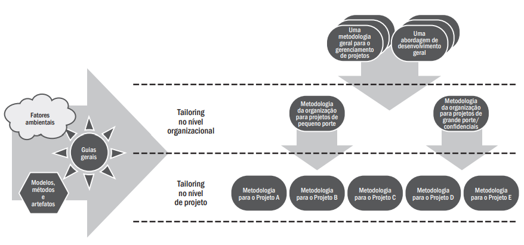
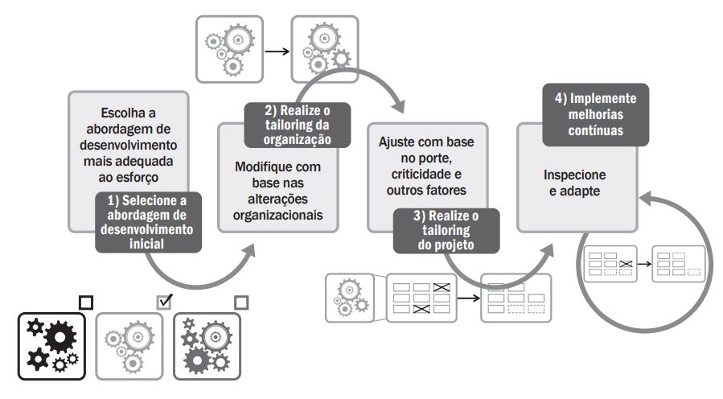
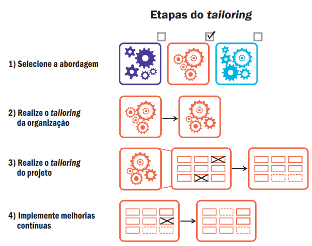
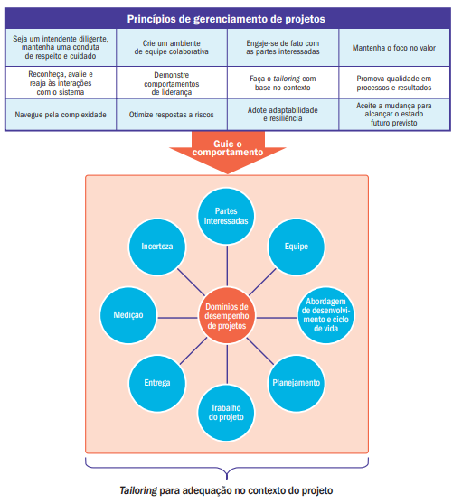

# Aula: Tailoring no PMBOK 7ª Edição

## Objetivo da Aula

Compreender o conceito de *tailoring* segundo o PMBOK 7ª edição, sua importância, e como aplicá-lo na prática para adaptar abordagens de gerenciamento de projetos a diferentes contextos organizacionais e de projeto.

---

## O que é Tailoring?

**Tailoring** é o processo de **selecionar e adaptar** metodologias, processos, práticas, ferramentas e técnicas para atender **às necessidades específicas de um projeto**.

> “Um sistema de entrega de valor deve ser adaptado para cada projeto.”  
> — PMBOK® 7ª edição

---

## Por que fazer Tailoring?

- Projetos são **únicos**: ambientes, equipes, escopo e riscos variam.
- Evita uso de práticas desnecessárias ou inadequadas.
- Aumenta a **efetividade** na entrega de valor.
- Torna o gerenciamento mais **eficiente e relevante**.

---

## Tailoring no Contexto do PMBOK 7

A 7ª edição se afasta da rigidez dos processos predefinidos e adota uma abordagem mais **baseada em princípios e domínios de desempenho**. Isso favorece a **flexibilidade** e **adaptação**.

### Princípios Relacionados:

1. Adaptar com base no contexto  
2. Foco no valor  
3. Customizar a abordagem

---

## O que pode ser Adaptado (Tailorado)?

- **Ciclo de vida do projeto** (previsível, adaptativo, híbrido)
- **Abordagens** (ágil, tradicional, híbrida)
- **Artefatos**
- **Ferramentas e técnicas**
- **Papéis e responsabilidades**
- **Rituais e cerimônias**
- **Formas de comunicação**

---
## Tailoring na organização

Embora as equipes de projeto possam adaptar seus processos (tailoring), as organizações geralmente exigem aprovação e supervisão. Muitas utilizam metodologias padrão como ponto de partida para garantir consistência, repetição e melhoria contínua. Quando existe governança de processos, o tailoring deve estar alinhado às políticas organizacionais. As decisões de adaptação precisam ser justificadas para não entrarem em conflito com os objetivos estratégicos da organização. Projetos de grande porte, de segurança crítica ou contratuais podem ter restrições adicionais, exigindo aprovação extra ou o uso de metodologias específicas.

---
## Etapas para Realizar o Tailoring

1. **Entender o contexto**  
   Tipo do projeto, setor, cultura organizacional, restrições legais.

2. **Selecionar práticas apropriadas**  
   Escolher abordagens e ferramentas que se alinham ao valor esperado.

3. **Adaptar e ajustar**  
   Modificar as práticas selecionadas para melhor adequação.

4. **Documentar decisões**  
   Justificar as escolhas feitas.

5. **Revisar continuamente**  
   Adaptar ao longo do tempo conforme as necessidades mudam.

---

## Exemplo Prático

Projeto: Desenvolvimento de um aplicativo mobile

| Fator              | Tailoring aplicado                           |
|--------------------|----------------------------------------------|
| Ambiente           | Startup com entregas rápidas                 |
| Ciclo de vida      | Abordagem ágil (Scrum)                       |
| Documentação       | Mínima, apenas backlog e metas               |
| Ferramentas        | Jira, Slack, GitHub, Trello                  |
| Cerimônias         | Sprints quinzenais e retrospectivas          |

---

## O Trello

**Trello** é uma **ferramenta de gerenciamento de tarefas** baseada em quadros e cartões. Ela é muito usada em projetos ágeis e colaborativos por sua interface visual simples. Com o Trello é possível:

- Organizar tarefas por etapas (ex: "A Fazer", "Em Progresso", "Concluído")
- Atribuir responsáveis e prazos
- Acompanhar o progresso do projeto

É bastante útil em ambientes dinâmicos, como projetos ágeis ou de startups.

---

## Cuidados ao Fazer Tailoring

- Não descartar práticas críticas sem justificativa
- Evitar adaptar por conveniência sem considerar o valor
- Envolver stakeholders nas decisões de tailoring
- Documentar para facilitar auditorias e lições aprendidas

---

## Benefícios do Tailoring

- Maior alinhamento com os objetivos do projeto
- Flexibilidade e resposta a mudanças
- Otimização de recursos e tempo
- Satisfação dos stakeholders

---

# Resumo –  Áreas a Considerar no Tailoring (PMBOK 7ª Edição)

## 1 Partes Interessadas

- Avaliar se há ambiente colaborativo com stakeholders e fornecedores.
- Identificar se as partes interessadas são internas, externas ou ambas.
- Analisar as tecnologias de comunicação disponíveis e economicamente viáveis.
- Considerar diversidade de idiomas e acessibilidade.
- Estimar a quantidade de stakeholders e a diversidade cultural envolvida.
- Avaliar a complexidade dos relacionamentos e redes de informações.

## 2 Equipe do Projeto

- Verificar localização física e distribuição geográfica da equipe.
- Considerar diversidade cultural e pontos de vista.
- Definir dedicação (tempo integral ou parcial) e envolvimento de prestadores de serviço.
- Avaliar a cultura da equipe e sua interação com o tailoring.
- Gerenciar o desenvolvimento da equipe com ferramentas existentes ou novas.
- Identificar necessidades especiais e treinamentos para diversidade.

## 3 Abordagem de Desenvolvimento e Ciclo de Vida

- Escolher a abordagem apropriada: preditiva, adaptativa (incremental/iterativa) ou híbrida.
- Definir o ciclo de vida do projeto e suas fases.
- Verificar políticas, diretrizes e governança existentes na organização.

## 4 Planejamento

- Avaliar fatores ambientais internos e externos que influenciam o projeto.
- Considerar fatores que afetam a duração e produtividade.
- Verificar políticas formais ou informais sobre orçamento e estimativas.
- Entender como são feitas estimativas em abordagens adaptativas.
- Avaliar complexidade em processos de aquisição e múltiplos fornecedores.
- Integrar leis e regulamentos locais com políticas organizacionais de aquisição.

## 5 Trabalho do Projeto

- Selecionar processos eficazes conforme cultura e complexidade do projeto.
- Promover ambiente colaborativo e gerenciar o conhecimento.
- Definir quais informações coletar, como armazenar e compartilhar.
- Garantir acesso a lições aprendidas e informações históricas.
- Utilizar repositórios formais de conhecimento da organização, quando disponíveis.

## 6 Entrega

- Verificar existência de sistemas de gerenciamento de requisitos.
- Avaliar políticas e práticas de validação e controle de qualidade.
- Identificar ferramentas e modelos de qualidade usados.
- Considerar padrões do setor, regulamentações e restrições legais.
- Lidar com requisitos instáveis com abordagens adequadas.
- Avaliar o impacto da sustentabilidade no projeto e no produto.

## 7 Incerteza

- Avaliar apetite e tolerância a riscos.
- Identificar ameaças e oportunidades no contexto da abordagem escolhida.
- Considerar a influência da complexidade, inovação e cadência do projeto.
- Avaliar se o porte do projeto exige uma abordagem mais detalhada.

---

## Conclusão

Tailoring é fundamental na 7ª edição do PMBOK. Ele permite que o gerenciamento de projetos seja mais contextualizado, eficaz e centrado no valor. Um bom gerente de projetos sabe quando e como adaptar práticas para atingir os melhores resultados.
### Tailoring – Conceito e Etapas

**Tailoring** é o processo de adaptação deliberada da abordagem, governança e processos para melhor atender ao ambiente e às necessidades específicas do projeto. Isso inclui ajustes nos elementos humanos, nos processos utilizados e nas ferramentas aplicadas.

#### Etapas do Tailoring

1. **Selecionar a abordagem inicial**  
   Escolher o ponto de partida com base no tipo de projeto e contexto.

2. **Realizar o tailoring da organização**  
   Adaptar conforme as diretrizes, políticas e práticas organizacionais.

3. **Realizar o tailoring do projeto**  
   Ajustar os processos, ferramentas e práticas para o contexto específico do projeto.

4. **Implementar melhorias contínuas**  
   Avaliar e aprimorar continuamente as práticas adotadas durante a execução.

> **Nota:**  
Embora o tailoring seja conduzido pelas partes interessadas do projeto, ele é orientado por diretrizes organizacionais. A governança assegura alinh

